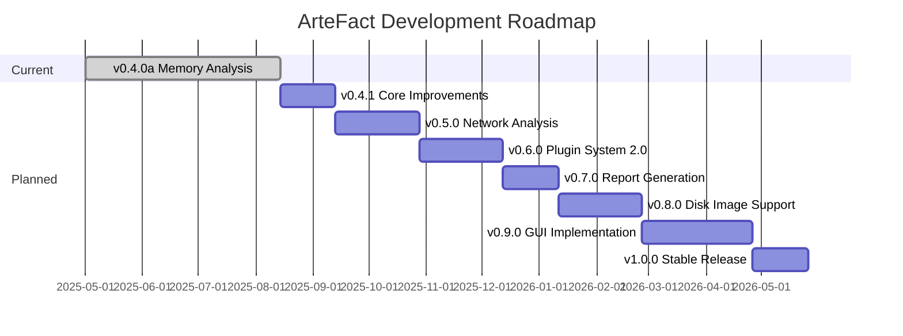

# Project Roadmap (ArteFact v0.4.0a)

This document outlines the planned features, improvements, and milestones for the ArteFact project. Each version focuses on specific areas of forensic capability, extensibility, or technical improvements.

## Visual Roadmap

## Detailed Version Plans

### v0.4.1 - Core Improvements

- **Code Optimization**
  - Refactor complex functions (carve_files, memory analysis)
  - Implement better abstraction for file format handling
  - Optimize memory usage during file carving
  - Add parallel processing for large file operations

- **Dependency Management**
  - Improve optional dependency handling
  - Add better fallbacks for external tools
  - Specific version pinning in requirements.txt
  - Implement dependency health checks

- **Testing & Documentation**
  - Increase test coverage for core modules
  - Add API documentation with examples
  - Improve complex feature documentation
  - Add benchmarking suite

### v0.5.0 - Network Analysis

- Parse and analyze PCAP files
- Extract network sessions and files
- Detect and analyze network-based IOCs
- Network timeline reconstruction
- Traffic pattern analysis
- Integration with threat intelligence feeds

### v0.6.0 - Plugin System 2.0

- Version-aware plugin system
- External plugin repository support
- Plugin metadata registry
- Plugin dependency management
- Plugin security verification
- Community contribution guidelines

### v0.7.0 - Report Generation

- Multiple report formats (HTML, PDF, Markdown)
- Customizable report templates
- Evidence chain integration
- Automated analysis summaries
- Timeline visualization
- IOC correlation reports

### v0.8.0 - Disk Image Support

- Support for common forensic formats (E01, AFF)
- Read-only access enforcement
- Filesystem analysis
- Deleted file recovery
- Volume shadow copy analysis
- Registry analysis (Windows)

### v0.9.0 - GUI Implementation

- Lightweight GUI using Qt
- Dark mode support
- Real-time analysis visualization
- Interactive timeline view
- Case management interface
- Evidence tracking system

### v1.0.0 - Stable Release

- Performance optimization
- Comprehensive testing
- Full documentation
- Security audit
- Plugin marketplace
- Enterprise feature set

## Technical Improvement Focus Areas

### Performance

- [ ] Optimize large file handling
- [ ] Implement smart chunking for memory operations
- [ ] Add parallel processing where beneficial
- [ ] Improve memory usage patterns
- [ ] Add caching for frequent operations

### Code Quality

- [ ] Refactor complex functions
- [ ] Improve type hinting coverage
- [ ] Add more comprehensive error messages
- [ ] Implement better logging
- [ ] Add performance monitoring

### Testing

- [ ] Increase unit test coverage
- [ ] Add integration test scenarios
- [ ] Implement performance benchmarks
- [ ] Add security testing
- [ ] Improve test documentation

### Documentation

- [ ] Expand API documentation
- [ ] Add more usage examples
- [ ] Improve setup guides
- [ ] Add troubleshooting guides
- [ ] Create video tutorials

This roadmap is subject to change based on user feedback, community contributions, and evolving forensic needs. Priorities may be adjusted based on security requirements and industry developments.
