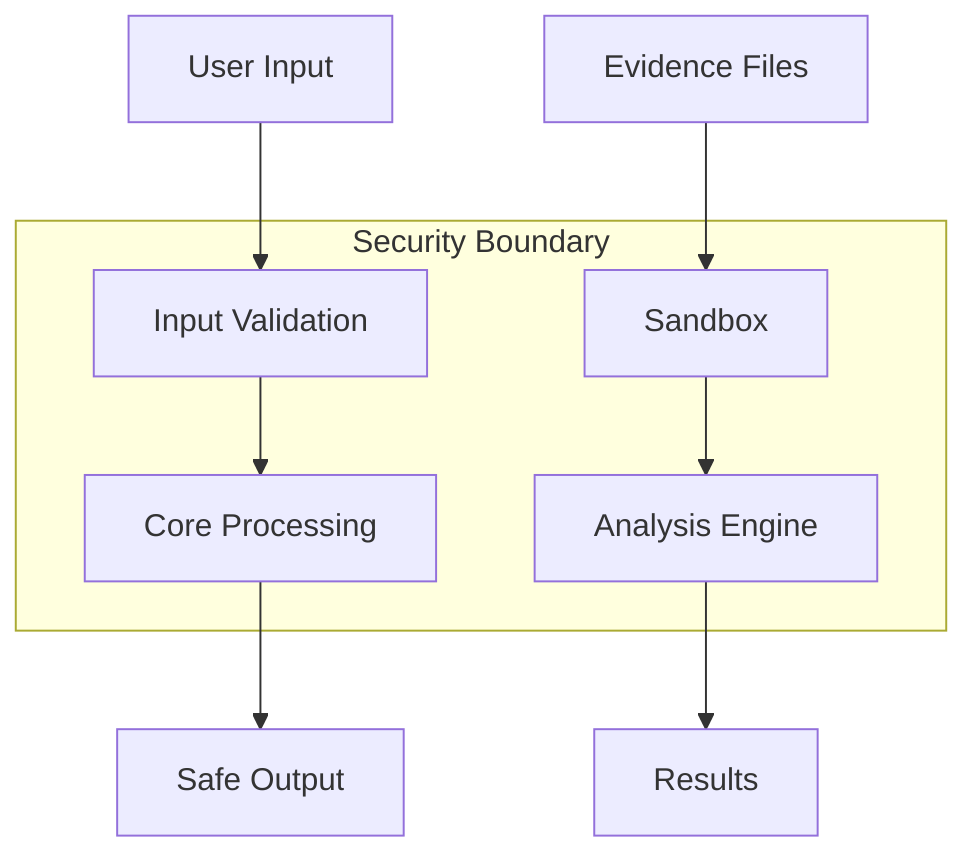

# Security Architecture and Threat Model

This document outlines ArteFact's security architecture, potential threats, and mitigation strategies.

## Security Principles

1. Minimal Attack Surface
2. Secure by Default
3. Defense in Depth
4. Least Privilege
5. Input Validation
6. Safe Output Handling
7. Secure Error Handling

## Trust Boundaries



## Threat Categories

### 1. Input Manipulation

**Risks:**
- Malicious file inputs
- Path traversal attempts
- Command injection
- Memory corruption

**Mitigations:**
- Strong input validation
- File type verification
- Memory safe operations
- Sanitized command execution

### 2. Resource Exhaustion

**Risks:**
- Memory exhaustion
- Disk space depletion
- CPU overload
- Handle leaks

**Mitigations:**
- Resource limits
- Memory monitoring
- Graceful degradation
- Resource cleanup

### 3. Plugin Security

**Risks:**
- Malicious plugins
- Dependency vulnerabilities
- Version conflicts
- API abuse

**Mitigations:**
- Plugin sandboxing
- Dependency scanning
- Version pinning
- API rate limiting

### 4. Data Security

**Risks:**
- Evidence tampering
- Information disclosure
- Data corruption
- Unauthorized access

**Mitigations:**
- File integrity checks
- Encryption at rest
- Access controls
- Audit logging

## Security Features

### Access Control

```yaml
permissions:
  files:
    read: required
    write: optional
    execute: none
  system:
    network: optional
    process: required
    memory: required
```

### Validation Checks

- File integrity verification
- Input sanitization
- Type checking
- Boundary validation
- Format verification

### Secure Processing

- Memory-safe operations
- Resource monitoring
- Graceful error handling
- Safe temporary files
- Secure deletion

### Audit Trail

- Operation logging
- Error tracking
- Access monitoring
- Change tracking
- Version control

## Implementation

### Code Security

```python
# Example of secure file handling
def process_file(file_path: Path) -> None:
    """Process file with security measures."""
    try:
        # Validate input
        if not is_safe_path(file_path):
            raise SecurityError("Invalid file path")
            
        # Check file type
        if not is_allowed_type(file_path):
            raise SecurityError("Unauthorized file type")
            
        # Resource limits
        with resource_limit():
            # Process in isolation
            with sandbox():
                process_safely(file_path)
                
    except Exception as e:
        log_security_event(e)
        raise
```

### Security Measures

1. Input Validation
   - Path normalization
   - Type checking
   - Size limits
   - Format validation

2. Resource Protection
   - Memory limits
   - CPU quotas
   - Disk quotas
   - Handle limits

3. Output Safety
   - Safe file handling
   - Secure deletion
   - Output validation
   - Error masking

4. Monitoring
   - Resource tracking
   - Error logging
   - Access logging
   - Integrity checks

## Security Considerations

### Development

1. Code Review Process
   - Security review
   - Dependency review
   - Performance review
   - Documentation review

2. Testing Requirements
   - Security testing
   - Fuzzing
   - Load testing
   - Integration testing

3. Deployment Checklist
   - Permission verification
   - Resource configuration
   - Logging setup
   - Backup verification

### Operations

1. System Requirements
   - Secure environment
   - Updated dependencies
   - Required permissions
   - Resource allocation

2. Monitoring Plan
   - Resource usage
   - Error patterns
   - Access patterns
   - Performance metrics

3. Incident Response
   - Error handling
   - Resource recovery
   - Incident logging
   - User notification

## Future Improvements

1. Enhanced Security
   - Plugin signing
   - Memory encryption
   - Network isolation
   - Container support

2. Better Monitoring
   - Real-time alerts
   - Performance tracking
   - Usage analytics
   - Health checks

3. Additional Features
   - Role-based access
   - Audit improvements
   - Compliance tools
   - Security APIs

## Security Updates

Security issues and updates are tracked in our [Security Policy](SECURITY.md).
